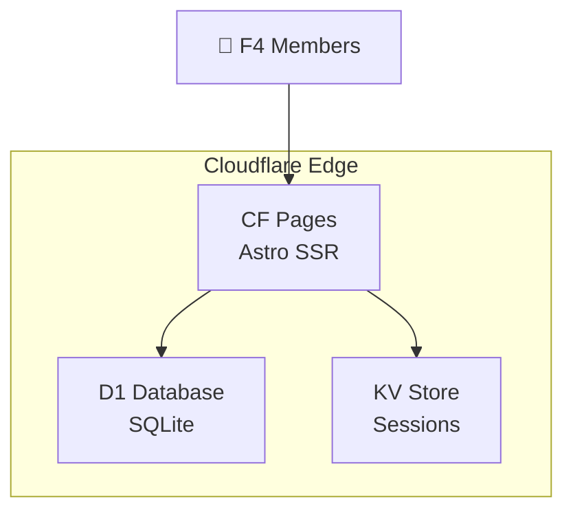

# 奉天F4Club — 私人社区网站

## 项目概述

为"奉天F4club"四位前游戏公司同事打造的私人社区网站，作为群聊的延伸，记录分享有趣的内容。

**成员**：佛（程序）、猛将（程序）、陈少（程序）、大壮（美术）
**话题**：🎮 游戏、🎬 电影、🏀 运动（篮球/羽毛球/马拉松）、📖 学英语

---

## User Review Required

> [!IMPORTANT]
> **技术方案选择**：推荐使用 **Astro SSR + Cloudflare Pages + D1 数据库**。这是目前最适合你需求的方案：
> - Astro 支持 SSR（服务端渲染），可以处理登录、发帖、评论等动态功能
> - D1 是 Cloudflare 的免费 SQLite 数据库，完美存储帖子和评论
> - 部署到 Cloudflare Pages + Functions，零成本运行

> [!WARNING]
> **关于本地开发**：D1 在本地通过 Wrangler 模拟运行，本地开发需要安装 `wrangler` CLI。首次部署到 Cloudflare 需要你有一个 Cloudflare 账号。

> [!IMPORTANT]
> **双语方案**：界面 UI 支持中/英切换，但帖子和评论内容不做翻译（用什么语言写就显示什么语言）。这样最自然。是否同意？

---

## 架构设计



### 技术栈

| 层 | 技术 | 说明 |
|---|---|---|
| 框架 | **Astro 5** (SSR mode) | 服务端渲染，支持动态路由 |
| 适配器 | **@astrojs/cloudflare** | 部署到 CF Pages |
| 数据库 | **Cloudflare D1** | 免费 SQLite，存帖子/评论/用户 |
| 会话 | **Cloudflare KV** | 存储登录 session |
| 样式 | **Vanilla CSS** | 极简设计系统 |
| 字体 | **Inter + Noto Sans SC** | 中英双语排版 |

---

## 数据库设计

### users 表
```sql
CREATE TABLE users (
  id INTEGER PRIMARY KEY,
  nickname TEXT NOT NULL UNIQUE,  -- 佛/猛将/陈少/大壮 (不可更改)
  role TEXT NOT NULL,              -- programmer / artist
  password_hash TEXT NOT NULL,
  avatar_emoji TEXT DEFAULT '👤',  -- 每人一个标识 emoji
  created_at DATETIME DEFAULT CURRENT_TIMESTAMP
);
```

### posts 表
```sql
CREATE TABLE posts (
  id INTEGER PRIMARY KEY AUTOINCREMENT,
  author_id INTEGER NOT NULL,
  title TEXT NOT NULL,
  content TEXT NOT NULL,           -- Markdown 格式
  category TEXT NOT NULL,          -- gaming / movies / sports / english
  sport_type TEXT,                 -- basketball / badminton / marathon (仅运动分类)
  lang TEXT DEFAULT 'zh',          -- zh / en
  created_at DATETIME DEFAULT CURRENT_TIMESTAMP,
  updated_at DATETIME DEFAULT CURRENT_TIMESTAMP,
  FOREIGN KEY (author_id) REFERENCES users(id)
);
```

### comments 表
```sql
CREATE TABLE comments (
  id INTEGER PRIMARY KEY AUTOINCREMENT,
  post_id INTEGER NOT NULL,
  author_id INTEGER NOT NULL,
  content TEXT NOT NULL,
  created_at DATETIME DEFAULT CURRENT_TIMESTAMP,
  FOREIGN KEY (post_id) REFERENCES posts(id),
  FOREIGN KEY (author_id) REFERENCES users(id)
);
```

### 初始用户数据
```sql
INSERT INTO users (nickname, role, avatar_emoji, password_hash) VALUES
('佛', 'programmer', '🧘', '<hashed>'),
('猛将', 'programmer', '⚔️', '<hashed>'),
('陈少', 'programmer', '🎯', '<hashed>'),
('大壮', 'artist', '🎨', '<hashed>');
```

> [!IMPORTANT]
> **密码设置**：初始密码可以在部署前设置，每人一个。你希望怎么设置初始密码？比如统一一个初始密码，登录后可以改？还是你给我指定4个密码？

---

## 项目结构

```
fengtian-f4club/
├── astro.config.mjs              # Astro + CF adapter 配置
├── wrangler.toml                 # CF Workers/D1 配置
├── package.json
├── tsconfig.json
├── db/
│   └── schema.sql                # D1 数据库初始化脚本
├── public/
│   └── fonts/                    # 本地字体文件
├── src/
│   ├── layouts/
│   │   └── Layout.astro          # 主布局（导航、页脚、主题切换）
│   ├── components/
│   │   ├── Nav.astro             # 顶部导航
│   │   ├── PostCard.astro        # 帖子卡片
│   │   ├── CommentSection.astro  # 评论区组件
│   │   ├── PostEditor.astro      # 发帖/编辑器
│   │   ├── MemberBadge.astro     # 成员标识徽章
│   │   ├── CategoryTag.astro     # 分类标签
│   │   └── LangSwitch.astro     # 语言切换
│   ├── pages/
│   │   ├── index.astro           # 首页（时间流 Feed）
│   │   ├── login.astro           # 登录页
│   │   ├── post/
│   │   │   ├── [id].astro        # 帖子详情页
│   │   │   └── new.astro         # 发帖页
│   │   ├── category/
│   │   │   └── [slug].astro      # 分类页 (gaming/movies/sports/english)
│   │   ├── member/
│   │   │   └── [name].astro      # 成员个人页
│   │   └── api/
│   │       ├── auth/
│   │       │   ├── login.ts      # 登录 API
│   │       │   └── logout.ts     # 登出 API
│   │       ├── posts/
│   │       │   ├── index.ts      # 创建帖子 API
│   │       │   └── [id].ts       # 帖子 CRUD API
│   │       └── comments/
│   │           └── index.ts      # 评论 API
│   ├── lib/
│   │   ├── db.ts                 # D1 数据库操作封装
│   │   ├── auth.ts               # 认证工具函数
│   │   └── i18n.ts               # 国际化配置
│   └── styles/
│       └── global.css            # 全局样式 + 设计系统
```

---

## 设计系统（极简风格）

### 色彩方案
```
主色调：    #1a1a2e → #16213e → #0f3460  (深色渐变背景)
强调色：    #e94560  (红色点缀)
文字色：    #eaeaea (主文字)  #8892b0 (次文字)
卡片底色：  rgba(255,255,255,0.03)
边框：     rgba(255,255,255,0.06)
```

### 分类色标
```
🎮 游戏：  #6c5ce7 (紫)
🎬 电影：  #fd79a8 (粉)
🏀 运动：  #00b894 (绿)
📖 英语：  #0984e3 (蓝)
```

### 设计特点
- **深色主题为主**，可切换到浅色
- **大量留白**，内容优先
- **卡片化布局**，统一圆角 12px
- **微动画**：hover 缩放、页面过渡
- **响应式**：桌面 + 移动端适配
- **每个成员有专属 Emoji + 颜色标识**

---

## 页面设计

### 1. 首页 (Feed)
- 瀑布流/时间线展示所有帖子
- 顶部可按分类筛选（全部/游戏/电影/运动/英语）
- 每个帖子卡片显示：标题、摘要、作者徽章、分类标签、时间、评论数
- 右侧/顶部导航：成员头像快速入口

### 2. 帖子详情页
- Markdown 渲染的内容
- 底部评论区
- 支持所有登录成员评论

### 3. 发帖页（需登录）
- 标题输入
- Markdown 编辑器（简单 textarea）
- 分类选择（下拉）
- 如果选"运动"，再选子分类（篮球/羽毛球/马拉松）

### 4. 登录页
- 极简设计：logo + 用户名选择 + 密码输入
- 4个用户名以按钮形式展示（点击选择）

### 5. 成员页
- 某个成员的所有帖子
- 简单的个人信息展示（昵称、角色、帖子数）

### 6. 分类页
- 按分类筛选的帖子列表

---

## Proposed Changes

### Phase 1: 项目初始化
- 使用 `npm create astro@latest` 初始化 Astro 项目
- 安装 `@astrojs/cloudflare` 适配器
- 配置 `wrangler.toml`（D1 + KV）
- 创建数据库 schema

### Phase 2: 设计系统 + 布局
#### [NEW] src/styles/global.css
全局 CSS 设计系统：变量、排版、组件样式

#### [NEW] src/layouts/Layout.astro
主布局模板：导航、页脚、语言切换、主题切换

### Phase 3: 后端 API
#### [NEW] src/lib/db.ts
D1 数据库操作封装（CRUD）

#### [NEW] src/lib/auth.ts
登录验证、Session 管理

#### [NEW] src/pages/api/*
RESTful API 端点：认证、帖子、评论

### Phase 4: 前端页面
#### [NEW] src/pages/index.astro
首页 Feed

#### [NEW] src/pages/login.astro
登录页

#### [NEW] src/pages/post/[id].astro & new.astro
帖子详情、发帖页

#### [NEW] src/pages/category/[slug].astro
分类页

#### [NEW] src/pages/member/[name].astro
成员页

### Phase 5: 组件
#### [NEW] src/components/*.astro
PostCard, CommentSection, PostEditor, MemberBadge, CategoryTag, Nav, LangSwitch

### Phase 6: 部署
- 构建并部署到 Cloudflare Pages
- 初始化 D1 数据库
- 创建 KV namespace
- 设置初始用户密码

---

## Open Questions

> [!IMPORTANT]
> 1. **密码**：4人的初始登录密码如何设置？统一一个？还是你指定4个不同的？
> 2. **域名**：是否已有域名？还是先用 CF Pages 提供的 `xxx.pages.dev` 子域名？
> 3. **Emoji 头像**：我为每人预设了 emoji（🧘佛、⚔️猛将、🎯陈少、🎨大壮），你觉得合适吗？可以更换。
> 4. **帖子格式**：是否支持图片上传？还是仅文字和链接？（图片上传需要额外用 CF R2 存储，稍复杂）
> 5. **是否需要"点赞"功能**？

---

## Verification Plan

### Automated Tests
1. 本地用 `wrangler dev` 模式运行，测试 D1 数据库连接
2. 测试所有 API 端点（登录/登出/发帖/评论）
3. 浏览器验证所有页面渲染

### Manual Verification
1. 在浏览器中完整走一遍流程：登录 → 发帖 → 评论 → 切换分类 → 查看成员页
2. 测试中英文切换
3. 移动端响应式检查
4. 部署到 CF Pages 后验证线上环境
